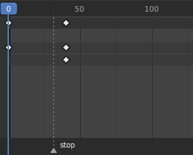
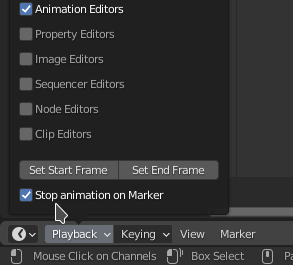

# Stop on Marker Add-on for Blender

**A blender addon stopping the animation playback if a special marker is reached.**

## Configuration
After enabling the add-on, you can toggle it's behavior via
1. the `playback` menu on the bottom left of the timeline
2. the add-on's own configuration menu

## Usage
1. Create a new marker
2. Name the marker 'stop'
3. Stat playback before the marker. Playback will stop automatically on 'stop' marker.
